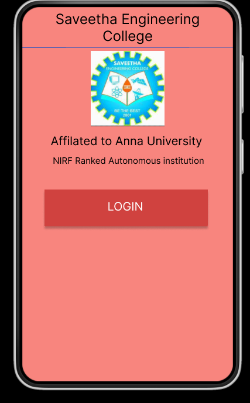
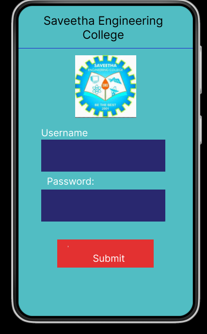
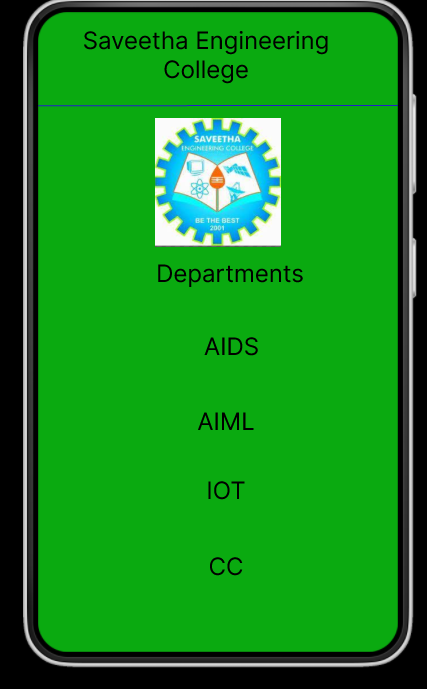

# Event Registration Web Application

## AIM:
To design, develop and deploy a web application for event registration.

## DESIGN STEPS:

### Step 1:
Create a new frame.

### Step 2:
Select any one preset size of your choice.

### Step 3:
Select the shapes you need.

### Step 4:
Import images as needed.

### Step 5:
Create pages based on your need and link them.

### Step 6:

Validate the HTML and CSS code.

### Step 6:

Publish the website in the given URL.

## DESIGN TOOL:
Figma

## code:
```
/* home page */
position: relative;
width: 360px;
height: 640px;
background: #F8857E;

/* Login page */
position: relative;
width: 360px;
height: 640px;
background: #51BDC4;

/* Section 1 */
box-sizing: border-box;
position: relative;
visibility: hidden;
width: 496px;
height: 496px;
background: #E5E5E5;
border: 1px solid rgba(0, 0, 0, 0.1);
border-radius: 2px;

/* Saveetha Engineering College */
position: absolute;
width: 336px;
height: 35px;
left: 0px;
top: 14px;
font-family: 'Inter';
font-style: normal;
font-weight: 400;
font-size: 24px;
line-height: 29px;
text-align: center;
color: #000000;

/* Departments */
position: absolute;
width: 336px;
height: 67px;
left: 24px;
top: 247px;
font-family: 'Inter';
font-style: normal;
font-weight: 400;
font-size: 24px;
line-height: 29px;
text-align: center;
color: #000000;

/* Saveetha Engineering College */
position: absolute;
visibility: hidden;
width: 336px;
height: 267px;
left: 0px;
top: 316px;
font-family: 'Inter';
font-style: normal;
font-weight: 400;
font-size: 24px;
line-height: 29px;
text-align: center;
color: #000000;
transform: matrix(1, 0, 0, -1, 0, 0);

/* Line 3 */
position: absolute;
width: 360.02px;
height: 0px;
left: 0px;
top: 94.21px;
border: 1px solid #201DCB;
transform: rotate(-0.03deg);

/* Screenshot from 2023-01-27 18-02-27 4 */
position: absolute;
width: 126px;
height: 129px;
left: 117px;
top: 106px;
background: url(Screenshot from 2023-01-27 18-02-27.png);

/* AIDS */
position: absolute;
width: 207px;
height: 39px;
left: 90px;
top: 320px;
font-family: 'Inter';
font-style: normal;
font-weight: 400;
font-size: 24px;
line-height: 29px;
text-align: center;
color: #000000;

/* AIML */
position: absolute;
width: 280px;
height: 57px;
left: 48px;
top: 395px;
font-family: 'Inter';
font-style: normal;
font-weight: 400;
font-size: 24px;
line-height: 29px;
text-align: center;
color: #000000;

/* IOT */
position: absolute;
width: 280px;
height: 57px;
left: 48px;
top: 464px;
font-family: 'Inter';
font-style: normal;
font-weight: 400;
font-size: 24px;
line-height: 29px;
text-align: center;
color: #000000;

/* CC */
position: absolute;
width: 280px;
height: 57px;
left: 48px;
top: 540px;
font-family: 'Inter';
font-style: normal;
font-weight: 400;
font-size: 24px;
line-height: 29px;
text-align: center;
color: #000000;
```
## OUTPUT:




## RESULT:
The program to design, develop and deploy a web application for event registration is completed successfully.